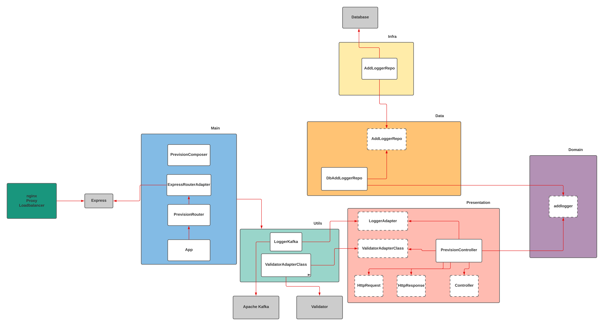

# D3 Challange
> Informações para execução do desafio

## Ferramentas necessario para teste local
* Node - LTS Version

## Execução do arquivo local
* va até a pasta raiz do projeto pelo CMD e digite o comando e execute:
    * npm i
* Executar o teste:
    * ainda na pasta raiz do projeto execute o comando "npm run test"
* Executar o projeto principal
    * ainda na pasta raiz do projeto execute o comando "npm run start"

## Execução do arquivo no Docker
* No CMD e na pasta raiz do projeto execute:
    * docker build -t d3/brito .
* Espera criar a imagem, caso error verificar os erros antes de prosseguir, então execute:
    * docker run d3/brito

# EXTRA
> ARQUITETURA

```sh
Microsservice
```



## Explicação
Arquitetura consiste inicialmente com um NGINX para fazermos:
    * Proxy
    * Loadbalancer
Um broker que ira interceptar as requests do microsserviço fazendo:
    * Apache Kafka
        * Log dos acessos a este microsserviço
A arquitetura que eu escolhi para a construção em si do microsserviço consiste em:
    * Clean Architecture
    * SOLID principles
Banco de dados como um BasS, do tipo NoSQL por tratarmos de apenas com dados brutos. O cloud escolhido é GCP(Google Cloud Plataform) pois garante o que precisamos.
    * Firebase